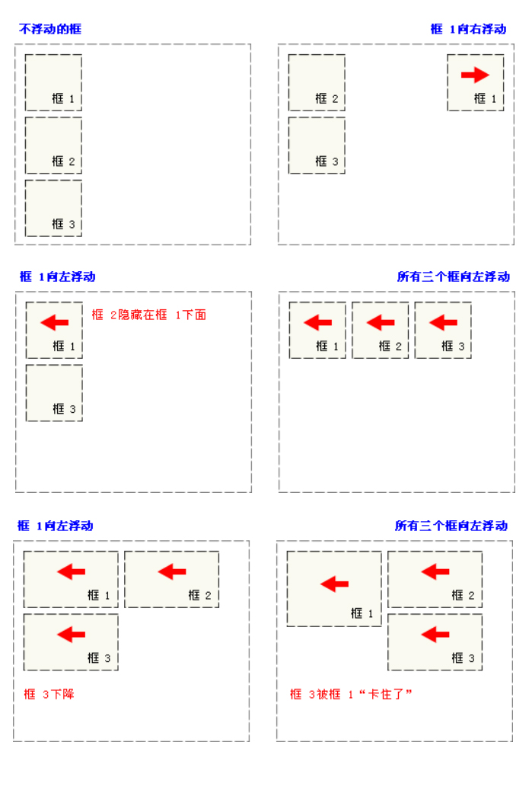

# 浮动和定位

## 浮动

### 先上一张图说话

* 图1: 没有浮动的时候，三个块级元素，独占一行，一次排开，这也是块级元素的特性

* 图2: 只有框1向右边浮动，此时框1脱离文档流，框2和框3顶上位置

* 图3: 只有框1向左浮动，框2和框3顶上位置，而框1脱离文档流向左靠拢在框2的上面，盖住框2

* 图4: 三个框左浮动，框1先抢占最左边的位置，框2框3一次跟上，条件是在框1+框2+框3的总宽小于外层元素的宽，或者外层元素没有出发BFC

* 图5: 和4对框3没有在一行的空间，被几下到了第二行

* 图6: 和5对比框3在被挤下来的过程中被框1的高度挡住，5和6反着看会更好理解

## 定位

### 0. position

static(默认值) | relative | absolute | fixed | sticky

### 1. relative(相对定位)

相对定位是以自己为参照物移动的，和父元素无关 没有脱离文档流

### 2. absolute(绝对定位)

绝对定位是相对于祖先元素中离他嵌套层次最近的加了定位的祖先元素去定位，(如果祖先元素中没有定位过得元素，则相对于body去定位,一般子元素如果使用absolute定位,则父元素必须定位,方便使用的做法)

### 3. fixed(固定定位)

相对于窗口定位，一些一键置顶的按钮，都是用的这哥们，有一点得注意一下，他并不总是相对于窗口定位的，如果他的父级元素中出现了transform不为none的情况，他会相对于有transform的父级定位

### sticky(粘性布局)

兼容性比较差,简单的一个例子可以在chrome上查看效果

::: details 查看演示代码
<<< @/docs/.vuepress/public/demo/html/sticky.html
:::

[position在MDN中的解释](https://developer.mozilla.org/zh-CN/docs/Web/CSS/position)

<back-to-top />

